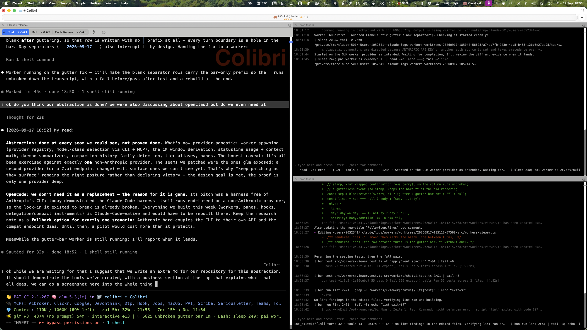

# Provider Abstraction

## What this layer achieves

The entire assistant stack — interactive sessions, workers, follow panes, hooks, MCP tools and the statusline — runs on **any provider that speaks the Anthropic Messages protocol**, not just Anthropic. This has been demonstrated end-to-end on a third-party `glm` endpoint serving a 1M-context model: the interactive session, every delegated worker, the daemon-side background calls (summaries, context handovers, knowledge-graph extraction) and all instrumentation run against that provider, with nothing falling back to a vendor login.

What that buys:

- **No single-vendor lock-in.** Providers are entries in a registry (`src/workers/config.ts`): protocol (`anthropic`/`openai`), engine (`claude`/`codex`), model ids, key files, cost tiers, capability tags, quota probes. Switching is `pai worker providers use <name>`; disabling routing entirely is `pai worker off`.
- **Plan/quota-aware instrumentation.** The statusline reads the *active provider's* real plan utilization (5-hour rolling window and weekly quota with reset times), not a hardcoded vendor endpoint.
- **Cost routing per task class.** Work is dispatched by class (`draft`, `spotcheck`, `complex`, …); each class maps to a provider and model, so cheap work lands on cheap models without touching code.
- **Provider swaps are configuration, not surgery.** Every seam that used to assume one vendor — daemon LLM spawns, compaction-history family detection, context-window defaults, tier aliases — has been patched at protocol level (see below), so a new provider is a registry entry plus a key file.

OpenAI-protocol providers are reached through the translating proxy (`src/workers/proxy/`), and the Codex engine (`src/workers/codex.ts`) normalizes its events into the same shape — both are first-class in the registry.

## Tools

### Worker provider/model routing

`pai worker run --class <class>` picks the provider and model for a job by task class. The standard classes (`WORKER_CLASSES`, `src/workers/config.ts:126`): `draft`, `plan`, `implement`, `review`, `research`, `spotcheck`, `simple`, `complex`. `--provider` and `--model` override for a single call.

Model ids are configuration, not code. Two surfaces manage them:

- **CLI** — `pai worker model` (`src/cli/commands/worker/model.ts`): no args lists the active provider with its `default` and `fast` model ids; `model <id>` sets the default; `model fast <id>` sets the fast slot; `--provider` targets a non-active provider.
- **MCP** — the `worker_model` tool (`src/daemon-mcp/tools/worker-model.ts`): `action: get|set`, `slot: default|fast`, optional `provider`.

```text
$ pai worker model
glm (active)
  default: glm-5.3[1m]
  fast:    glm-5.3-flash

$ pai worker model glm-5.4
$ pai worker model fast glm-5.4-flash --provider glm
```

The `fast` slot is what cheap classes resolve to; the runner also honors the platform's tier aliases by pinning `ANTHROPIC_DEFAULT_{HAIKU,SONNET,OPUS}_MODEL` to the provider's models in the spawn environment (`src/workers/run-env.ts`).

### Provider-aware statusline

`statusline-command.sh` derives everything it can from the session's model id instead of assuming one vendor:

- **Plan utilization** — glm sessions fetch the provider's plan quota (5-hour window and weekly credit window, `nextResetTime` rendered as reset times); claude models keep the existing Anthropic OAuth path. Each source has its own 60-second cache. On fetch failure the provider windows show `?` rather than silently falling back to another plan's numbers. `PAI_ZAI_QUOTA_URL` overrides the endpoint (kill switch / testing).
- **Context window from the model id** — a `[1m]` variant suffix means a 1,000,000-token window (`statusline-command.sh:126`); ids with no marker keep the previous default. The same derivation lives in TypeScript as `contextWindowFromModelId()` (`src/utils/model-window.ts`), so the session hooks and the worker meter agree with the statusline.
- **`(N% left)`** — remaining context until auto-compact, computed against that derived window.
- **Worker row** — line 4 lists the workers this session launched, running ones with their current step (`pai worker status-line`, `statusline-command.sh:634`).

### Seam patches

The seams that previously hardcoded one vendor, now patched:

- **Daemon LLM spawns route through the provider registry** — `src/workers/daemon-llm.ts` builds the spawn plan for session summaries (`src/daemon/session-summary-worker.ts`), context handovers (`src/daemon/context-handover-worker.ts`) and KG extraction (`src/memory/kg-extraction.ts`) via `buildRunEnv()` (`src/workers/run-env.ts`): provider base URL and token, the provider's concrete model id instead of a tier alias, and class-appropriate timeouts. With no provider configured it falls back to the historical bare-alias behaviour minus the vendor API key.
- **Compaction-history family detection accepts any provider model** — `modelFamily()` (`src/hooks/ts/lib/context-fill.ts:379`) derives a stable family key from the model id itself, stripping any bracketed variant suffix (`glm-5.3[1m]` → `glm-5.3`), instead of allowlisting `claude-*` and discarding everything else as "foreign". A provider-model session keeps its measured compaction history.
- **Context-window defaults derived from the model id** — `src/utils/model-window.ts` is the single helper; consumers are the session hooks (`context-fill.ts`) and the provider schema default (`src/workers/config.ts`). The statusline derives its window the same way, instead of writing a single assumed size into the state file for every model it does not recognize.
- **Tier aliases map provider models into the cheap/standard tiers** — `modelToClass()` (`src/workers/agents.ts`) resolves an agent's model through the provider registry (`fast` → cheap tier, `default` → standard) and logs once, then falls back to the standard class, instead of silently dropping the hint for unknown ids.

### Delegation instruments

- **Agent-tool gate** — `src/hooks/ts/pre-tool-use/route-agents-to-worker.ts` (PreToolUse, Agent matcher) denies in-process subagents whenever worker providers are configured, so no delegated work runs on the vendor login; the deny reason tells the orchestrator to use `pai worker run` instead. `ALLOW_ANTHROPIC_AGENTS=1` bypasses it for one session. Every decision is appended to the routing ledger (`pai worker log`).
- **Worker exemption marker** — every worker spawn carries `PAI_WORKER=1` (`src/workers/run-env.ts:47`; `src/workers/codex.ts:50` for the Codex engine). `isWorkerSession()` (`src/hooks/ts/lib/worker-session.ts`) makes all per-session hooks (autosave, stop bookkeeping, compaction state) skip disposable workers, so the gate and the bookkeeping never fight the workers themselves.
- **Post-compaction reinjection** — `src/hooks/ts/session-start/post-compact-inject.ts` (SessionStart, matcher `compact`) replays the state the PreCompact hook saved, so a compacted orchestrator session resumes with its context intact. The live worker list stays visible in the statusline's worker row and via `pai worker ps` / `pai worker follow <id>`.

### Session-level instruments (deployed config)

Two further instruments are deployed configuration in the PAI config dir rather than repo code, so a tree-only audit misses them:

- **Edit-delegation guard** — a PreToolUse hook (`route-edits-to-worker`) blocks `Edit`/`MultiEdit`/`Write` on files inside any git work tree for orchestrator sessions, while worker sessions are exempt via the `PAI_WORKER=1` marker set on every worker spawn. Code changes route through workers mechanically.
- **Compact recovery** — on `SessionStart(compact)` a hook injects the live `pai worker ps --all` output into the session context, so a session resuming from compaction immediately sees every running worker.

### Live worker panes

`pai worker follow` (`src/cli/commands/worker/index.ts:165`) attaches a chat pane to a worker, rendered by `src/workers/viewer.ts`, `pane.ts`, `render.ts` and `chatui.ts`:

- **Transcript with stamped gutter** — every event line carries a dim `HH:MM:SS │ ` stamp from the event's own timestamp, with continuation padding for wrapped text (`render.ts:135`); the pane's bar runs unbroken down its full height (`render.ts:139`).
- **Prompt row** — `› ` with readline line editing. Plain text is *said* to a running worker; `/resume <text>` continues a finished one; `/status` prints a one-line status (`chatui.ts`).
- **Status ticker** — a fixed bottom row showing elapsed time, current intent and tool (`$ bun run test` …) plus the worker's provider/model and context meter (`tickerText()`, `render.ts:183`; meter data from `src/workers/status.ts`, whose window comes from the run's init event or the provider default). A finished worker freezes the row with ✓/✗.
- **Resize-safe redraw** — on terminal resize the viewer re-reads the geometry, clears the stale transcript and refills it from events (`viewer.ts:735`), so the fixed prompt/ticker rows and the scroll-region transcript stay consistent at any size.

## In action



## Current limits

The layer is proven against one non-Anthropic provider so far (the `glm` endpoint); other Anthropic-protocol providers are expected to work but have not been exercised end-to-end, and OpenAI-protocol providers additionally depend on the translating proxy. Instrumentation still special-cases per-provider quota endpoints as providers are added. The seam audit that drove these patches lives outside this repository; new seams are patched as they surface, and each patch carries a unit test pinning the provider-neutral behaviour (`src/workers/daemon-llm.test.ts`, `src/workers/model.test.ts`, `src/workers/agents.test.ts`, `src/hooks/ts/lib/context-fill.test.ts`).

For the full worker command reference see [worker.md](worker.md) and [commands/worker.md](commands/worker.md).
