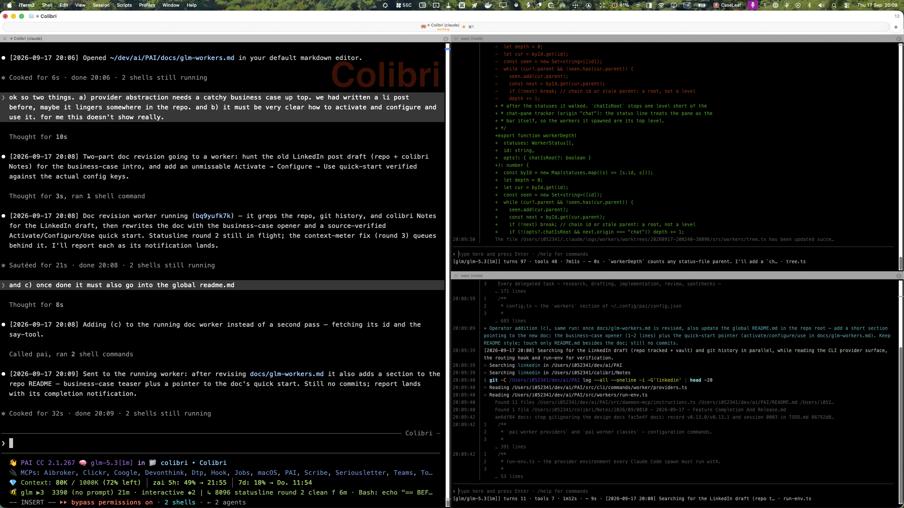

# Provider Independence

I started my Thursday at 5am, which is normal — and at about 80%, which is not.

Because those 80% are not motivation (that was certainly higher). That is the weekly usage of my Claude Max 200 subscription.

With still two days to go, I was getting worried. Last week I had already hit 100% hard — despite all my efficiency gains, including creating my own "Agentish" language.

At 9am I was above 90%, and there was no way I would make it through to Saturday 8am, the weekly reset.

So I decided to solve this problem. At 10pm I am at 97% — and that number has not changed since noon.

This post shows how to become provider-independent. How to free yourself from Claude, so a maxed-out subscription stops being your problem. How to use any cloud model and any local model inside your Claude Code (or OpenCode) harness. How to run models in parallel, each for what it is good at — all purely local, without resorting to yet another Hermes-or-whatever harness. How to have workers run by default, visibly — and how to interact with each of them in its own chat.

My whole journey into PAI and AIBroker started nine months ago, when I used OpenClawd for four hours and had burned through all my credits. I decided then and there that there had to be a better way: instead of API tokens, use the Claude Max subscription I was paying for anyway.

Nine months later, I ran into the next wall: maxing out the Claude Max subscription itself. So the next level of independence was required — and I made that happen, today. Here is what happened.

I made myself independent of Claude and Fable. They are great — but I hate being locked in, and I suspect most of us do. I want to decide which model I use: Claude, GLM, Grok, whatever. I need to abstract away from that choice.

Fable was — and is — great, but it burns tokens. And Opus on its own is so unbelievably dumb that I had taken to letting Fable do everything, even forcing it to not use agents — burning tokens even faster.

So the requirements were:

1. **Provider independence.** Switch to any model at any time — not only for agents, but for the main orchestrator session too.
2. **Cloud and local.** Any cloud model, and local models.
3. **Visibility.** Really see what each worker is doing — not Claude Code's click-into-a-worker-and-make-sense-of-it, but every worker in a side pane, automatically.
4. **Direct chat.** Talk to any worker while it runs.
5. **Hardening.** Each worker in its own worktree, so parallel work cannot destroy itself.
6. **Forced orchestration.** Not just ask the orchestrator to delegate — deterministically enforce that it spawns workers.
7. **Cost routing.** Automatically pick cheaper workers for simpler tasks.
8. **Keep the harness.** Stay on Claude Code (I could have switched to OpenCode — turns out it was not even necessary).

The whole implementation cost 7 of my last 10 percentage points of Claude Max 200. Then I switched to GLM for everything else. And what can I say — it works beautifully.

---

> My AI budget hit 91% before lunch. So I changed one rule: the expensive
> assistant keeps the thinking, a cheaper crew does the building. The feature
> shipped anyway.
>
> Your AI bill is not a fact of nature. It is a design decision.

Your assistant runs its helper crew on whichever AI provider you choose —
and so can the session itself.

## Switching

- **The crew.** Once, at the start: "Add a worker provider named <provider> — here
  is the key." Then: "Use <provider> for the workers from now on."
- **The session itself.** Start it with the `<provider>` command — the shim for
  `pai worker run` — or just pick a project with `pai`: the picker follows
  the active provider too, so the whole session, you included, runs on it.

Swapping back — or to any other provider — is one sentence for the crew, and
starting `claude` again for the session.

## A day with the crew

- "Fix the login timeout bug." — a worker named *fix login timeout* starts; the status line shows its name and current step, live.
- "What are my workers doing?" — a short list, by name.
- "Tell fix login timeout to also check the retry path." — lands mid-run; the worker adapts.
- "Show me what it changed." — the diff comes back for your review.
- "Stop using workers for now." — the crew stands down.

## Further

- [How it works — full tool reference](provider-independence-details.md)
- [The provider layer, in depth](provider-abstraction.md)
