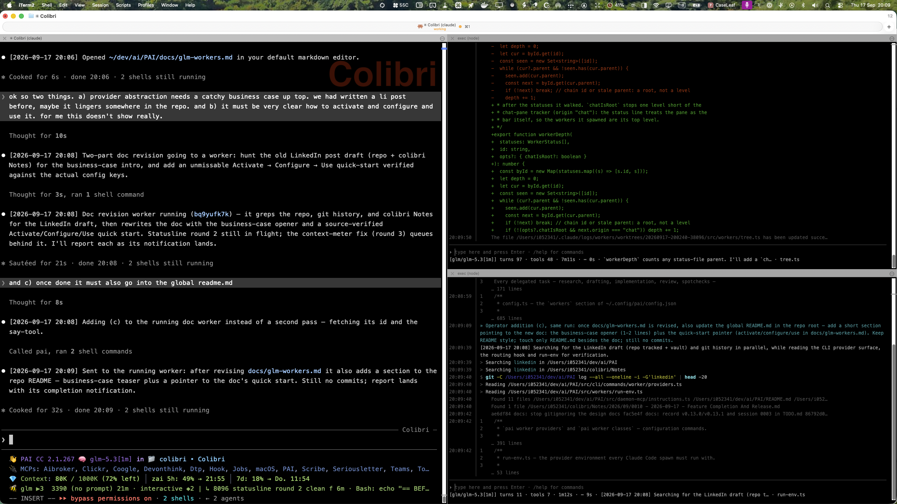

# Worker Providers — Run the Fleet Anywhere

**Read the story: [Provider Independence — how I freed my stack from a single vendor in one day](provider-independence.md).**

Only the outer orchestrator session runs on Anthropic. Every worker PAI spawns — research, drafting, implementation, review, spotchecks — runs on a managed provider you choose. The same provider layer carries the daemon's background calls and the session picker, so the whole stack moves together.

## Why

- **Vendor independence.** Any provider that speaks the Anthropic Messages protocol is a registry entry: models, key file, price tier. OpenAI-protocol providers work through a built-in translating proxy. Switching is configuration, not surgery.
- **Cost control.** Parallel work is a commodity; it should not burn your premium seat. Workers bill against their own provider, and cheap classes resolve to the provider's fast model automatically.
- **No lock-in to one orchestrator vendor.** Sessions run on the active provider too — the picker launches through it, and `pai worker fallback` extends that machine-wide.
- **Survives orchestrator outages.** Workers carry their own provider credentials, so a quota freeze or outage on the vendor seat does not stop delegated work.

## How

- **Managed providers.** `pai worker providers add` registers one, `pai worker providers use <name>` switches the fleet, `pai worker off` disables routing entirely (the Agent tool runs on Anthropic again), `pai worker on` re-enables it. The reserved name `anthropic` needs no `add` step — it's Claude Code's own login; `pai worker providers use anthropic` switches straight to it.
- **Start the harness itself on any provider.** `pai launch` (numbered picker, or `--provider <name> [--model <model>]`) starts a fresh Claude Code session on any provider/model in `workers.yaml` — a running session can't switch providers (base URL and auth are fixed at start), so this always begins a new one. Claude Code's own `/model` only lists the current endpoint's models; `pai launch --list` (or the `/providers` skill, from inside a session) lists every provider configured here.
- **Classes route work to the right model.** `--class` picks the provider and model for the job: `draft`, `plan`, `implement`, `review`, `research`, `spotcheck`, `simple`, `complex`, `image`. `pai worker classes` shows and edits the mapping; `--provider` / `--model` override for a single run.
- **Every worker spawn stands alone.** The orchestrator's API key is stripped and the spawn gets the provider's base URL, token and model ids instead — proven live: a worker answers with the parent's credentials gone. No inherited billing, no fallback to the vendor login.
- **The route is pinned, not inherited.** Claude Code's user settings outrank the process env, so a machine-wide proxy route (a `caveman` install, a `pai worker fallback`) would otherwise swallow a worker's base URL and send its provider token to the wrong endpoint. Every spawn repeats its route with `--settings`, which outranks user settings; native-Anthropic workers are pinned to `api.anthropic.com`, or launched as `caveman claude` when `workers.caveman: true` is set in `config.yaml`. Details: [docs/worker.md](worker.md), "What a worker is".
- **One file to configure it.** Providers, per-role model ids and class routing live in one hand-editable `workers.yaml` — adding a provider (Anthropic-compatible, OpenAI-compatible, or local) is a YAML edit, never code. Full reference: [docs/workers-config.md](workers-config.md).

```yaml
active: anthropic
providers:
  anthropic:
    builtin: true                 # Claude Code's own login
    models: { default: claude-sonnet-5, fast: claude-haiku-4-5-20251001 }
  glm:
    url: https://api.z.ai/api/anthropic
    key: "<your-api-key>"         # or key_file: <path to a 0600 file>
    tier: 3
    models: { default: glm-5.3[1m], fast: glm-5.3-flash }
classes:
  implement: anthropic
  spotcheck: anthropic/fast       # cheap classes default to the fast model
```

## What

```bash
pai worker run -p '<task>' --class implement   # one worker on a provider
pai worker ps                                  # this session's workers (--all: every one)
pai worker follow <id>                         # live transcript of one worker
pai worker pane                                # shared follow pane for the session
pai worker replay <id>                         # transcript of a finished or running worker
pai worker say <id> <text>                     # message a running worker mid-run
pai worker handoff '<json>'                    # from inside a worker: report to the parent
pai worker merge <id>                          # merge the worker's branch back, drop the worktree
pai worker wait <id>...                        # block until workers finish (never sleep-loop)
pai worker watch                               # ps refreshed every 2 seconds
```

The rest of the surface — `discard`, `resume`, `controls`, `proxy`, `mcp`, `model`, `providers`, `classes` — is in `pai help worker` and [docs/commands/worker.md](commands/worker.md).



Get started in three copy-paste steps: **[docs/provider-independence.md](provider-independence.md)**. For the depth — provider registry, statusline instrumentation, seam patches, current limits — see **[docs/provider-abstraction.md](provider-abstraction.md)**.
